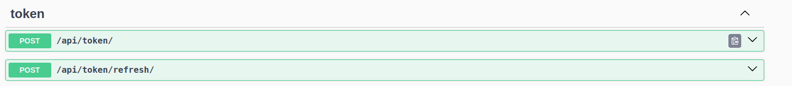
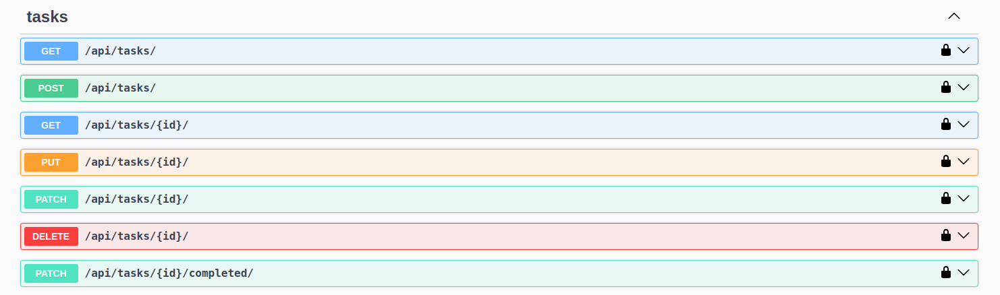

# AndersenTechnicalTask
A technical task solution for Andersen Lab, showcasing skills in Python programming, algorithmic problem-solving, and software development best practices. Includes clean, testable code with unit tests using pytest, and demonstrates familiarity with real-world development workflows.

# Table of Contents

1. Features
2. Installation
3. Usage
4. Deployment
5. CI/CD
6. API Documentation
7. Linters & Developer Commands
8. Technologies Used

# 🚀 Features

🔐 User Authentication

- Secure user registration and JWT-based login system.
- Access and refresh tokens handled via cookies for enhanced security.
- Automatic token renewal via a refresh token endpoint.
- Logout functionality blacklists tokens to prevent reuse.
- "Logout All" feature revokes all active tokens, logging the user out from all devices.

📝 Task Management

- Authenticated users can create, view, update, and delete tasks.
- Tasks are restricted to their owners — only the creator can modify or delete them.
- One-click status toggle to mark tasks as completed.
- Filters available to view tasks by status, search query, and owner.

🧪 Testing

- Extensive unit and integration tests.

📡 Comprehensive API

- Fully RESTful API design.
- Auto-generated API documentation via Swagger and ReDoc for easy developer access.

🐳 Dockerization & Deployment

- Fully containerized using Docker and Docker Compose for consistent local and production environments.
- Automated deployment pipeline set up with GitHub Actions, enabling CI/CD workflows.
- Deployed on AWS EC2 (Free Tier) with Nginx as a reverse proxy for secure and efficient traffic handling.
- Easily scalable and maintainable deployment architecture suitable for production use.

# 🛠️ Installation

Follow these steps to set up the project locally:

1. Clone the Repository

    - git clone https://github.com/shabnamadil/AndersenTechnicalTask.git

2. Create a Virtual Environment (Recommended)

    - python3 -m venv venv  
    - .\venv\Scripts\activate(Windows)  
    - source venv/bin/activate(MacOs, Ubuntu)

3. Setup project

    - make dev-setup

4. Run Migrations

    - make migrate-all

5. Start the Development Server

    - make dev-run

# 🧑‍💻 Usage
This system enables both end-users and developers to perform the following key actions:

🔐 Authentication & Account Management

- Register new user accounts securely.
- Log in with credentials and obtain access via JWT tokens.
- Stay authenticated via secure cookie-based tokens.
- Refresh authentication tokens without re-entering credentials.
- Log out from a single session or all active devices.

📋 Task Lifecycle Management

- Create new personal tasks with a title, status and optional description.
- View a list of all tasks belonging to the authenticated users.
- Update task content or toggle completion status.
- Delete tasks that are no longer needed.
- Filter tasks by:
    - Completion status
    - Search keywords
    - Creator

🛡️ Security and Access Control

- Tasks can only be modified by their creators
- Token blacklisting ensures logged-out sessions cannot be reused.

🧪 Testable and Developer-Friendly

- All functionality is accessible via a RESTful API.
- Auto-generated Swagger and ReDoc documentation makes it easy to explore and test endpoints.
- Suitable for frontend integration or mobile app development.

# 🚀 Deployment

This project is containerized and deployed to production using Docker and AWS EC2. Below are the key deployment features.

- 🔗 Live demo: http://13.60.211.242/api
- Dockerized Application for consistent environments across dev and production.
- Automated deployment using GitHub Actions.
- The app is deployed to an AWS EC2 Free Tier instance with Docker Compose.
- Uwsgi as the WSGI server.
- Nginx is configured as a reverse proxy to serve the application and handle requests efficiently.

# 🔄 Continuous Integration & Development (CI/CD)

This project includes a basic CI/CD pipeline using GitHub Actions, configured to:

- Lint the code using flake8, black, and isort.
- Run tests on every push to main.

# 📄 API Documentation
The project provides comprehensive, auto-generated API documentation to facilitate easy integration and testing.

- Swagger UI: Accessible at [/api/docs/](http://13.60.211.242/api/docs/) — offers an interactive interface where you can explore all available API endpoints, view request/response schemas, and test API calls directly.
- ReDoc: Accessible at [/api/redoc/](http://13.60.211.242/api/redoc/) — provides a clean, structured, and readable format of the API documentation for detailed review.

# 🧹 Linters & Developer Commands

To maintain a clean and professional codebase, the project uses several tools for linting, formatting, security, and type checking. You can run them using the following `make` commands:

### ✅ 1. `make enable-pre-commit-hooks`
Installs the pre-commit Git hooks defined in .pre-commit-config.yaml file. These hooks run automatically before every commit to enforce code quality checks (e.g., formatting, linting).
💡 Tip: Run this once after cloning the repo to ensure Git hooks are enabled.

### ✅ 2. `make format`
Auto-formats your Python code using:

- black – for consistent code style
- isort – to sort imports
- autopep8 – to fix PEP8 issues
- autoflake – to remove unused imports and variables

### ✅ 3. `make lint`
Checks the code for common style and complexity issues using:

- flake8 – for style violations and complexity checks
- black and isort – in check mode (does not modify files)

### ✅ 4. `make secure`
Runs a security analysis using bandit, focusing on high-severity and high-confidence vulnerabilities.

### ✅ 5. `make type-check`
Performs static type checking using mypy with support for Django via django-stubs.

### ✅ 6. `make test`
Run all tests throughout the project

# 🛠️ Technologies Used

🛠️ Technologies Used

🔙 Backend

- Python 3.11+
- Django 4.2
- Django REST Framework
- PostgreSQL
- SimpleJWT

🐳 DevOps and Deployment

- Docker & Docker Compose
- GitHub Actions
- AWS EC2
- Nginx + uWSGI

🧪 Testing & Quality

- Pytest

🧹 Makefile for automation

-Black, isort, autopep8, autoflake
- Flake8
- Bandit
- Mypy

📄 Documentation

- Swagger
- ReDoc